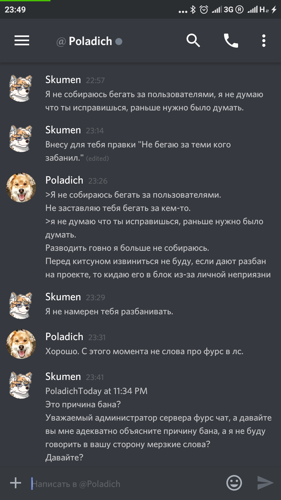
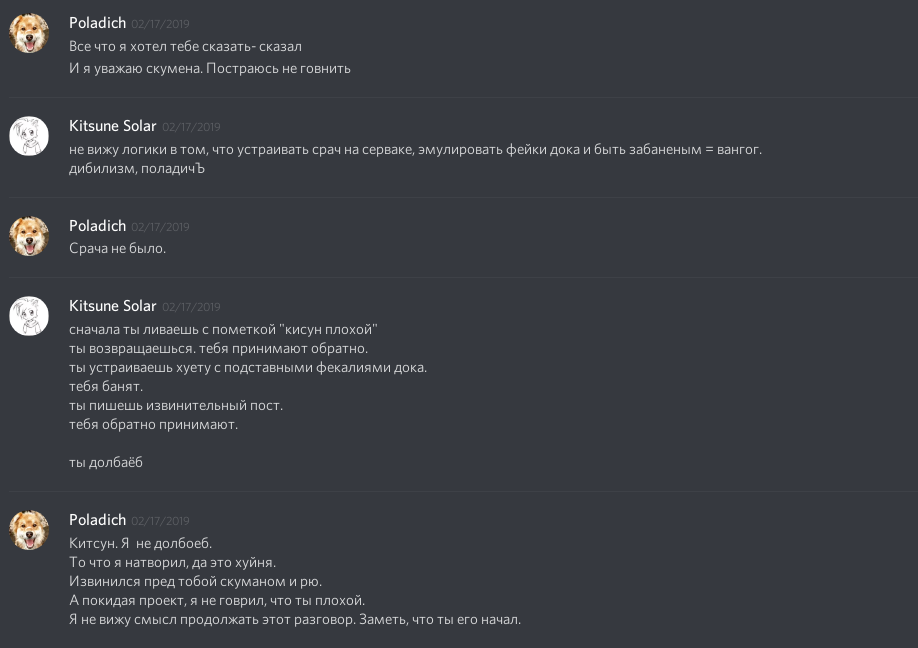
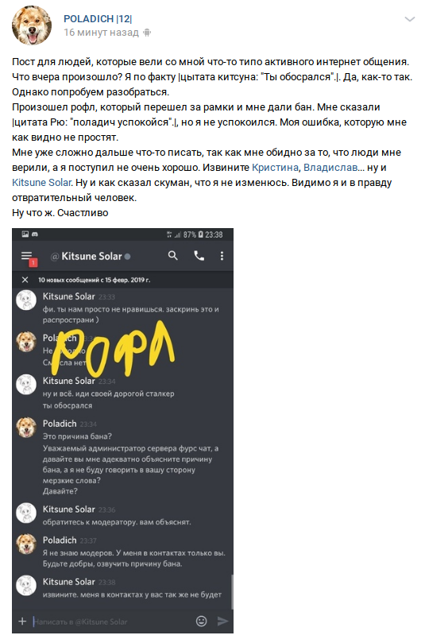
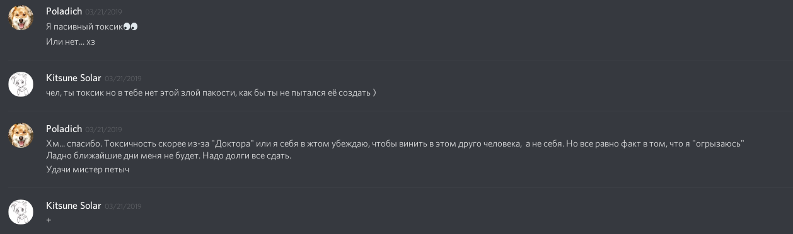
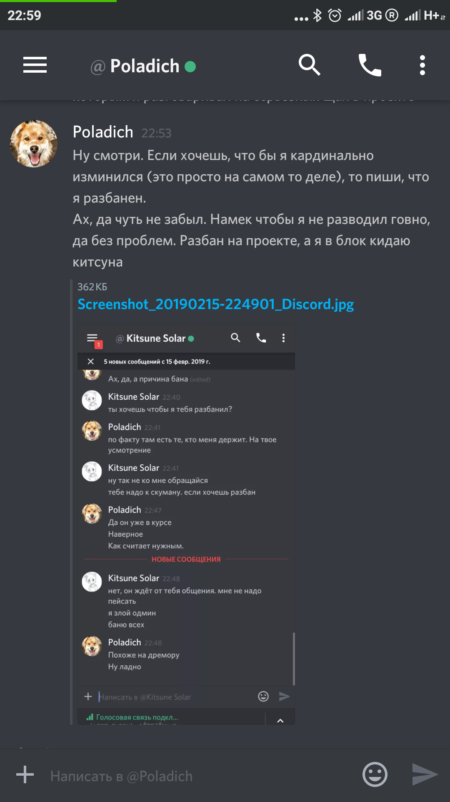

- Discord ID: `313405589436891148`
- Nickname: `Poladich#7400`

**Poladich** сделал для сервера много плохих вещей. От СПАМА (да, этот человек спамил по личкам), до провокационный действий.

1. Устраивал рейды на сервер.
2. Занимался троллингом участников.
3. Подговаривал участников к нарушения правил.
4. Создавал фейки для осуществления провокаций.

Администрация его много раз прощала. Человек извинялся неоднократно за свои действия. Но это стало последней каплей и человек окончательно был забанен. Если вы увидите его у себя на сервере, будьте осторожны.

## Извинение №1

**Poladich** раскаивается и говорит что "разводить говно больше не буду".

## Извинение №2

Здесь **Poladich** в очередной раз обещает вести себя хорошо. Его опять прощают и принимают обратно.

## Извинение №3

Здесь **Poladich** решил извиняться в своей группе ВК. Как только понял, что администрация прочла его сообщение, **Poladich** удалил пост со страницы. Но мы оперативно зафиксировали.

Почему **Poladich** здесь извиняется? С поддельного фейка решил устроить провокацию. Был вычислен и забанен.

## Извинение №4

Тут **Poladich** опять раскаивается. Подтверждает свою токсичность.

## Шантаж администрации

**Poladich** решил шантажировать администрацию. **Poladich** в край уже охамел и обнаглел. Он понимает что администрация лояльно относится к "провинившимся" участникам и может опять разбанить участника **Poladich**. Поэтому, **Poladich** идёт на шантаж.

## Спам по личным сообщениям

**Poladich** спамит по личным сообщениям. Добропорядочный участник нашего сообщества рассказал об этом администрации.

